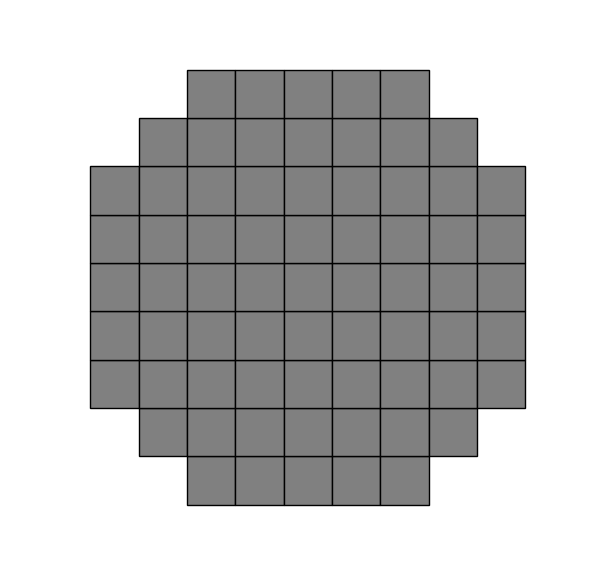
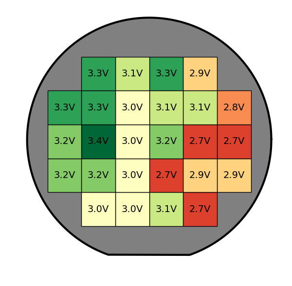
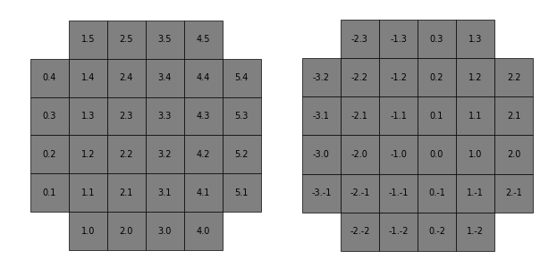
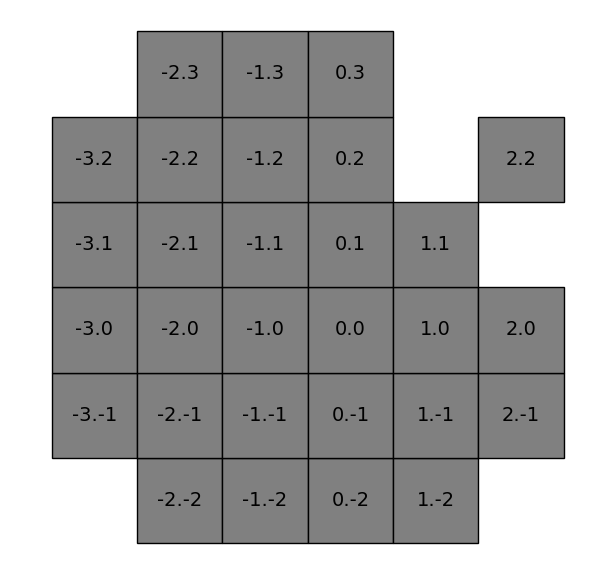

# Wafflemap

Wafflemap is a simple Python module that helps you draw wafermaps. It covers simple functions like creating a wafermap with arbitrary shape and die count, coloring dies and labeling them.

This module is aimed at __simple__ representations of wafermaps, mostly for presentation/schematic purposes, and for basic data analysis.

- [Wafflemap](#wafflemap)
  - [Examples](#examples)
  - [Disclaimer](#disclaimer)
  - [Installation and requirements](#installation-and-requirements)
  - [Basic Usage](#basic-usage)
    - [Constructor (`Wafflemap`)](#constructor-wafflemap)
    - [`plot_dies`](#plot_dies)
    - [`plot_wafer_outline`](#plot_wafer_outline)
      - [Adding a notch](#adding-a-notch)
  - [Complements](#complements)
    - [Other attributes of the `Wafflemap` class](#other-attributes-of-the-wafflemap-class)
    - [Changing colors and hatch](#changing-colors-and-hatch)
    - [Colormaps](#colormaps)
    - [Labeling dies](#labeling-dies)
    - [Default parameters](#default-parameters)
  - [Complete descriptions of the functions](#complete-descriptions-of-the-functions)
  - [FAQ](#faq)
    - [How do I change the size of the dies?](#how-do-i-change-the-size-of-the-dies)
    - [How do I change the color of multiple dies?](#how-do-i-change-the-color-of-multiple-dies)
    - [How do I make a nice colormap like the one in the example above?](#how-do-i-make-a-nice-colormap-like-the-one-in-the-example-above)
    - [My wafermap is cut off at the edges](#my-wafermap-is-cut-off-at-the-edges)
    - [My wafer outline is too big](#my-wafer-outline-is-too-big)
    - [I don't like how my wafermap turned out :(](#i-dont-like-how-my-wafermap-turned-out-)
    - [I can't print the die list of my wafermap (it's truncated by the console)](#i-cant-print-the-die-list-of-my-wafermap-its-truncated-by-the-console)
  - [License](#license)

The intended use of this module is to write a series of commands in either on an Notebook cell or on an independent file that you can run again and again while adjusting the parameters of each function until you get exactly what you want.

## Examples
<sup>[(Back to top)](#table-of-contents)</sup>

Here is an example of the most basic wafermap you can get:

```python
import wafflemap
# Create a wafermap instance
wm = wafflemap.Wafflemap()
# plot your wafermap
wm.plot_dies(imshow=True) # imshow=True only necessary if not using %matplotlib inline
```
which gives you this:



But some tweaks and customisation you can get something like this!
```python
import wafflemap
import matplotlib.colors
import matplotlib.cm as cm
import numpy as np
wm=wafflemap.Wafflemap([1,6],[1,5], v_flip=False , h_flip=True)
# randomly generated voltage for example purposes
wm.df["Voltage"] = ["{:.1f}V".format((x+y-3)/14+2.8 + np.round(np.random.rand()/2.5-0.2, 1)) for (x,y) in wm.df.xy]
norm = matplotlib.colors.Normalize(vmin=2.6,vmax=3.4)
for (x,y) in wm.df.xy:
    wm.set_color(x,y, cm.RdYlGn(norm(float(wm.get_value(x,y,'Voltage').strip("V")))))
wm.plot_dies(margin=5, imshow=False) # imshow=True only necessary if not using %matplotlib inline
wm.plot_wafer_outline(18, y_offset=-1, notch='S', notch_type='f', notch_size=3,
                       facecolor='gray')
wm.label_all_dies(column='Voltage', fontsize=7)
```




## Disclaimer
<sup>[(Back to top)](#table-of-contents)</sup>

Please note that you will most likely not get something like the example above on your first try. This module is intended to be used **iteratively**, mainly because I couldn't make something that yielded good, consistent and automatic results. Therefore I advice that you start with a simple wafermap and add more and more complexity with the help of the module functions until you get what you want. in this file you will find tips and examples to guide you. Hopefully you will find this tool useful :)

## Installation and requirements
<sup>[(Back to top)](#table-of-contents)</sup>

Since this is an amateur module, and since I don't know much about modules, the easiest way to use wafflemap is to put `wafflemap.py` in the same directory as the file that will import it, or in a folder that is in your `PYTHONPATH` variable.

This module requires numpy, pandas and matplotlib

## Basic Usage
<sup>[(Back to top)](#table-of-contents)</sup>

This section  explqins how to use the most important functions of the module to create simple scheatics that resembles the wafers you work with.

The main functions you'll need are the constructor, `plot_dies` and `plot_wafer_outline`. The constructor is the function that will take all the information about your wafer (ie. number of dies length-wise and height-wise, die size and the coordinate system you use for your dies), `plot_dies` is the function in charge of rendering all the visual properties of your dies, such as color and hatch, and `plot_wafer_outline` lets you add a circle (with or without a notch) to frame your dies.

### Constructor (`Wafflemap`)
Let's start with the constructor. The first thing you should know about this function is that it creates wafermaps by first creating a grid of `m` by `n` squares, and then removing the squares in the corners to make it look more like a wafer. Both the length `m` and height `n` of said grid have default values, which is why in the first example above you can get a simple wafermap by just calling the constructor without any arguments (`wm = wafflemap.Wafflemap()`). If you want to create a wafermap with different dimensions, then you can pass one interval for the length and one for the height. The reason to use intervals and not just integers is to also establish the coordinates of your dies. If you don't care about die coordinates then you can create an `a` by `b` wafermap by writing `wm = wafflemap.Wafflemap(x_range=[1,a], y_range=[1,b])`. If you do care about die coordinates, then you can take a look at your reference wafer, note the extreme coordiantes for x and y and pass them to the constructor. Below is an example of two wafermaps, one created with `wafflemap.Wafflemap([0,5],[0,5])` and the other with `wafflemap.Wafflemap([-3,2],[-2,3])` (coordinate labels were added to differentiate them)



Let's focus on the second wafermap: What if you don't want one of the dies, for instance the die (2,2), to appear on the final image? In deed usually dies at the edges of a wafer tend to be defective, so sometimes its best to leave them out of an analysis.

You have the flexibility to add or remove dies from the wafermap with the methods `add_die(x,y)`, `add_die_list(<tuple-list>)`, `remove_die(x,y)` and `remove_die_list(<tuple-list>)`. If you want to add or remove a single die, you must pass its coordinates, and if you want to add or remove a list of dies, you must pass a list of `(int,int)`. Here is an example based on the second wafermap above:
```python
wm = wafflemap.Wafflemap([-3,2],[-2,3])
wm.remove_die_list([(1,3),(1,2),(2,1),(2,2)]) # removal of multiple dies
wm.add_die(2,2) # addition of a previously removed die
wm.plot_dies()
wm.label_all_dies(fontsize=7)
```



If you already have a list of the dies you want to plot, you can just pass that list onto the `die_list` argument of the constructor. The previous example can also be obtained like this:
```python
d_list = [(-3, -1), (-3, 0), (-3, 1), (-3, 2), (-2, -2), 
          (-2, -1), (-2, 0), (-2, 1), (-2, 2), (-2, 3), 
          (-1, -2), (-1, -1), (-1, 0), (-1, 1), (-1, 2), 
          (-1, 3), (0, -2), (0, -1), (0, 0), (0, 1), (0, 2), 
          (0, 3), (1, -2), (1, -1), (1, 0), (1, 1), (2, -1), (2, 0), (2, 2)]
wm = wafflemap.Wafflemap([-3,2],[-2,3], die_list = d_list)
wm.plot_dies()
wm.label_all_dies(fontsize=7)
```
Maybe this method is more cumbersome, but it may come in useful in certain situations. 

Notice that all the dies of the list must be comprised in the coordinate ranges of the wafermap. Dies outside this range will be ignored without warning.

If you ever want to save the die list of your wafermap, you can print it on the console with the method `get_die_list()`

Finally, if your reference wafer has a die coordinate system oriented differently than the default, you can flip the wafermap coodinate system horizontally, vertically, or both with the boolean arguments `h_flip` and `v_flip` (both set to `False` by default).
### `plot_dies`
This method is the one responsible for drawing the wafermap. It can be called without any arguments as shown in some of the previous examples. Since this module is meant to be used in either a Jupyter Notebook (where you can plot graphics inline) or a python file (which sometimes requires an additional `plt.show()` command), the boolean argument `imshow` can be used to automatically call `plt.show()` when it is set to `True`. By default `imshow` is set to False.

Another useful argument of this method is `dies_to_plot` although, admittedly, its purpose is somewhat redundant. You can use this argument to pass a list of dies that you want to appear on the plot, all other dies will be ignored regardless of wether they had been added or removed with the methods seen in the previous subsection. By default it is set so that only the dies added to the wafermap are plotted.

Finally there is a `margin` argument that allows you to increase the margin between the wafermap and the edge of the figure. It can be set to a positive or negative `float` and it works by readjusting the scale of the figure.

### `plot_wafer_outline`

This is the most complex method of the module due to the number of arguments it has. I tried to simplify its usage as much as possible and help the user to find their desired outcome through trial and error, whith some help from the module. You don't have to use this method if you only want to plot the dies.

If you call this method without any arguments, it will calculate a starting radius for the outline, and plot a circle centered as accurately as possible around the dies. The calculated radius will be printed on the console as weel to give you a starting point to set your own radius if you want.
Thus after an initial call without arguments, you can rerun your Notebook cell or you script with an adjusted radius, as well as additional horizontal and vertical offsets to center the outline more precisely. You ca do so through the parameters `radius`, `x_offset` and `y_offset` repectvely.

You can further customize your wafer outline with the arguments `facecolor`, `edgecolor` and `linewidth`, which allow you to change the background color, the line color and line width of the outline, in the same way you woul

#### Adding a notch
You can add a notch to visualize the orientation of your wafer. To add a notch, pass one of the following characters to the `notch` argument: `'N'`, `'S'`, `'E'`, `'W'`. As you may have guessed, the position of the notch corresponds to the entered cardinal point. Next you can change the type of notch with the `notch_type` argument. Passing `'c'` gives you a circular notch, `'e'` gives you an elliptic notch, and `'f'` makes a flat cut notch. The size of the notch can be controlled with the `notch_size` argument, which by default is equal to 3.

## Complements
### Other attributes of the `Wafflemap` class
- `Wafflemap.df`: The majority of the module operates based on a pandas DataFrame that contains all the information regarding the dies of the wafer. Each row of the DataFrame represents a die and each column represents a property of the dies, such as coordinates and color. This attribute is available to you to store information in case you want to use it on your wafermap. In the second figure of this document you can see that a new column was created with random values. These values were meant to emulate voltages that one could have measured. Once the values are set in a column, they can be used by other functions to make a colormap or labels, as will be explained further down.
- `Wafflemap.ax` and `Wafflemap.fig`: Respectively an `Axe` and a `Figure` objects from the matplotlib library, used to draw the wafermap. If you want to add any customization to your wafermap via matplotlib functions, you can use these attributes to do so. Also if you want to put multiple wafermaps on a single figure, you can do so by first creating a figure with as many axes as you want, and then passing each axe to the constructor method on the `ax` argument. By doing so, the `fig` attribute will automatically become the figure you created, and when you plot the wafermap, it will be done on the corresponding subplot of you figure!
### Changing colors and hatch
You can change the color and hatch of individual dies with the methods `set_color(x, y, color)` and `set_hatch(x, y, hatch)`, where `x` and `y` are the die coordinates, and the `color` and `hatch` arguments are strings that follow the matplotlib specifications. Check out the [color reference](https://matplotlib.org/stable/users/explain/colors/colors.html#colors-def) and [hatch reference](https://matplotlib.org/stable/gallery/shapes_and_collections/hatch_style_reference.html) for more info.
### Colormaps
TBD
### Labeling dies
You can add a label to  a single die via the method `label_die(x, y, label, loc, fontsize, **kwargs)`, where ``x`` and ``y`` are the die coordinates, `label` is the text to be written on the die **or** the name of the column of the DataFrame on which to look for the label. ``loc`` is the location of the label and can be one of 9 options (``'upper'``, ``'center'``, ``'lower'``, ``'upper left'``, ``'center left'``, ``'lower left'``, ``'upper right'``, ``'center right'`` and  ``'lower right'``), and you can pass any other keyword that can be accepted by the [annotate function](https://matplotlib.org/stable/api/_as_gen/matplotlib.pyplot.annotate.html) of matplotlib.

For labelling all the dies on the wafermap there is the method `label_all_dies()`, which requires only the name of a DataFrame column to get the labels from. It also accepts any keyword handled by ``annotate``.
### Default parameters
## Complete descriptions of the functions
<sup>[(Back to top)](#table-of-contents)</sup>
TBD
## FAQ
<sup>[(Back to top)](#table-of-contents)</sup>

### How do I change the size of the dies?
You can't. Wafermaps are plotted to occupy as much space as possible within the size of the figure. If you want your dies to look bigger with respect to your wafer outline, consider decreasing the `radius` parameter of the `plot_wafer_outline` method (if you don't set a value for `radius`, then it will be estimated an returned to you via the console, you can use that suggested value to guide your choice of a better value). If you want your dies to look wider or narrower, you can do it by changing the value of `die_aspect_ratio` in the constructor function.
### How do I change the color of multiple dies?
You can use the method `colorfill_die_list(list, color)` to change the color of multiple dies. The difficult part of this process is usually *how to get the list of dies you want to color*, and for that there are some solutions:
- (click select on the GUI version that i will eventually make)
- get the list from a folder with `os.listdir()`
### How do I make a nice colormap like the one in the example above?
Colormaps are done with matplotlib and completely independently from this module. If you have a range of values that you wish to map to a colorscale, you can do so with the functions provided by matplotlib. Once the colormap has been created, you can paint the dies accoridingly with the method `set_color(x,y,color)`. Here is a detailed example:
### My wafermap is cut off at the edges
Try adding a bigger margin to the figure. You can do that with the `margin` parameter in the `plot_dies` method.
### My wafer outline is too big
When calling `plot_wafer_outline` without passing a value for `radius`, the function calculates a radius based on the dimensions of the wafermap and it outputs the calculated radius value on the console. You can use that result to adjust the value passes onto `radius` and run your script again. Once you have a starting value for your outline radius, you can adjust it little by little until get the outline you want.
### I don't like how my wafermap turned out :(
Sorry to hear that :( this module is in deed fairly limited in its customizing capabilities. Keep in mind that the wafermaps produced with this module are mainly for presentation and schematic purposes. Finally, as a last resort, you may want to save your wafermap as an svg file and edit it yourself in a vector grpahics editor such as Inkscape. You can save your wafermap with the method `save_svg(filename)` or with the usual `plt.savefig(filename, format='svg')` 
### I can't print the die list of my wafermap (it's truncated by the console)
Running this on the console should fix it:
```python
import sys
import numpy as np
np.set_printoptions(threshold=sys.maxsize)
```

## License
<sup>[(Back to top)](#table-of-contents)</sup>

 Wafflemap Python module © 2024 by [Martin Arteaga](https://github.com/martecast) is licensed under [CC BY-NC-SA 4.0](https://creativecommons.org/licenses/by-nc-sa/4.0/) 
